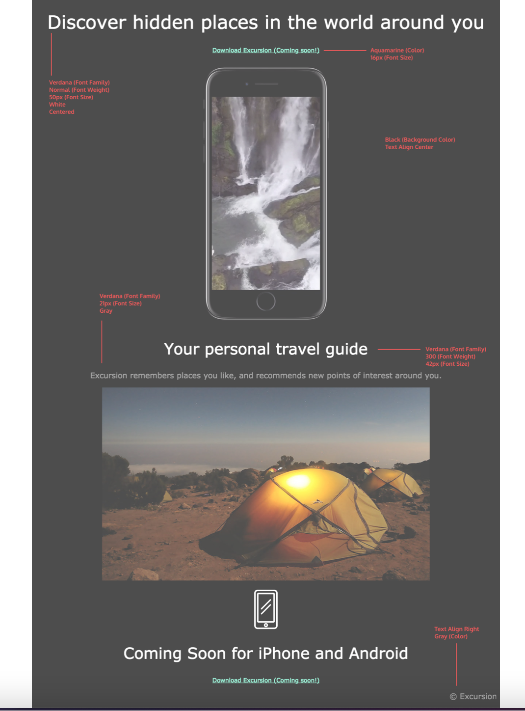

# Project Name
> Off-Platform Project: Excursion
A project for IT CSWITCH
 HTML, CSS, Command Line Interface, Git, and GitHub.

## General Information
 In this project, I created a web page which advertises a product called “Excursion.
The web page I built advertises a mobile app which helps users record and share their experiences, I have used video and landscape imagery to set the scene. 
A landing page is a vital tool in marketing a product these days, and the goal will be to entice potential customers into using the product. 

## Screenshots
